# 卡盘—尾座节能保压液压系统 仿真验证报告（v1.1）

> 对象：发明专利申请《一种数控车床卡盘—尾座节能保压液压系统、试验台及控制方法》（`06_申请文件/`），本目录 `图/专利附图/图16~18` 对应申请文件说明书附图 图11~图13。
> 版本：v1.1，2026-10-01。v1 经独立复核（第 12 节）后修正了两处建模错误并补充了四项输出，修正前后的差异见 12.2 节。所有参数取自 `00_设计基准/设计基准参数.json`（V1.1），本子任务新增的假设值列在 3.3 节。
> 可追溯：Python 3.14.6、NumPy 2.5.3、SciPy 1.18.1；蒙特卡洛随机种子 20261001。全部数值由 `03_仿真验证/脚本` 中的程序计算，可重复运行。结果均为数值计算，未做实物试验。

## 1 结论摘要

| 技术问题 | 仿真 | 对比对象 | 关键结果 |
| --- | --- | --- | --- |
| （一）定量泵溢流保压能耗高 | 能耗模型（单件循环 656 s） | 方案1 原系统；方案2 单腔锁闭+蓄能器；方案3 恒压减压供油 | 保压阶段平均泵轴功率：方案1 1264 W（AMESim 1.24 kW），方案2/3 84.4 W，本发明 1.16 W；单件电能 287.8 / 23.0 / 23.0 / 5.7 Wh；本发明相对原系统节电 98.0%，年耗电 3159 → 63 kWh |
| （二）锁闭腔对工件热伸长、油温漂移敏感 | 准静态保压模型，工况 C1~C7 | 方案2、方案3 | 综合工况 C6（伸长 57.5 µm + 油温 +0.1 K/min）最大推力偏差：方案2 +27.9%，方案3 +5.1%，本发明 +7.2%；油温升 0.2 K/min（C3）方案2 +41.6%，本发明 +2.5%/−4.8%；细长轴 138 µm（C2）方案2 +30.4%，本发明 +7.7% |
| （三）恒压供油刚度低 | 静刚度、动柔度、切削力阶跃（动态模型） | 方案2、方案3、消融 M2S | 额定伸出量顶尖静刚度：本发明 42.6 N/µm，单腔锁闭（阀块直装）30.3，方案2（含软管）19.4，方案3 在 1 Hz 只有 0.13 N/µm；1 kN 阶跃顶尖位移：本发明 23.6 µm，方案2 50.9 µm，方案3 让位约 7.5 mm |
| 稳健性 | 单因素敏感性 29 组、减压阀回差 12 组；蒙特卡洛 N=2000 | 方案2、方案3、本发明方案乙 | 最大推力偏差 P95：方案2 55.3%，方案3 7.3%，本发明（甲）10.1%，方案乙 11.6%；超过安全上限 1.25F0 的比例：方案2 30.2%，本发明 0 |
| 工件伸长估算 ΔL（说明书式（4）） | 准静态模型内置估算器 | 位移传感器法（对照） | 仅工件伸长（C1）最大误差 6.4 µm；油温 ±0.2 K/min（C3/C4）17.2/20.6 µm；综合工况（C6，内泄漏×1）28.5 µm，内泄漏×0.1 时 11.9 µm；内泄漏×4（C5）183 µm。推力油温法不能区分内泄漏，误差随回复次数累积 |

### 1.1 结论的稳健性

- 求解器校核：准静态模型的刚度和热漂移系数与设计基准推导式相差 ≤6×10⁻⁵（双腔 45.54 N/µm、440.2 N/K；单腔 33.33 N/µm、1745.7 N/K）；动态模型的静位移、阻尼固有频率、超调峰值与单自由度解析解相差 0.11%、0.05%、0.003%；rtol 由 1e−4 加严到 1e−9，结果变化 <1×10⁻⁶。
- 准静态步长由 4 s 减到 0.25 s，本发明综合工况最大推力变化 ≤0.14%，方案2 ≤0.14%。
- 原系统能耗模型 1.264 kW、溢流损失 1.214 kW，与课题组 AMESim 结果（1.24 / 1.22 kW）相差 1.9% / 0.5%。
- 蒙特卡洛 N 由 500 增至 2000，本发明 P95 由 9.82% 变为 10.05%；自助法 95% 置信区间 9.91%~10.14%。

### 1.2 对本发明不利或有保留的结果（方案缺陷及修订）

1. **顶尖实际推力会超出推力带上限约 2.4 个百分点。** 控制器只能根据 p1·A1−p2·A2 判断推力。活塞静摩擦力 F_s=150 N（2.5%F0）使顶尖力与液压力之间存在不可测的差值。工件伸长时，顶尖力最高到 +7.4%（C1）、+7.7%（C2），超过设定的 +5%。F_s 取 0 时为 +5.0%，带宽 ±2% 时为 +4.7%（敏感性表 6.1）。三通减压阀的不灵敏区 0.05 MPa（约 156 N）也让回复终点偏在设定值上方。**修订：** 推力带上限改为 F_H=(1+b)F0−F_s,cal；b 取 ±3% 左右；F_s,cal 在试验台上用微位移加载单元标定（申请文件已写入说明书实施例6(3)，未写入权利要求）。另把减压阀 R1 的设定值按不灵敏区下移一半（脚本参数 `rev_center`）。这项修订对正偏差改善很小，只能作为辅助措施。
2. **小推力下偏差变大。** F0=2000 N 时，本发明 C6 偏差为 15.3%，原因是摩擦占 F0 的比例升高。蒙特卡洛中偏差超过 10% 的 5.3% 样本，集中在低 F0 等效、高摩擦的组合。**修订：** 说明书写明，推力带宽按 max(b·F0, F_s+Δ) 取值；在实施例中给出低推力时的处理。
3. **方案乙（阻尼孔脉冲微泄）不如方案甲。** 蒙特卡洛 P95 为 11.6%，最大 25.1%（方案甲 19.6%）。方案乙只能单向泄放，泄放后有杆腔仍保持预压，回复不对称。权利要求1 草稿把“微泄座阀 21 + 阻尼孔 22”写成必要特征，这与“方案甲优选”相矛盾。**修订：** 权1 改为上位的“经回复通路使两腔压力双向回复到设定值”，三通减压阀方案（甲）和阻尼孔方案（乙）分别作为从属权利要求（现行申请文件已按此修改：权1 写“推力回复单元”，方案甲、乙分别为权3、权4）。
4. **节能效果主要来自卡盘回转接头卸压和 V0 隔离，不是来自尾座双腔锁闭本身。** 方案2 和方案3 的保压能耗几乎相同（都是 84.4 W）。能耗中 466.7 cm³/min 的回转接头泄漏占 87%；滑阀 55 cm³/min，减压阀泄油 16.5 cm³/min。尾座锁闭方式对能耗的影响 <0.01 W。双腔预压锁闭的作用是刚度和油温补偿，不是节能。说明书“有益效果”要分开写，不要把 98% 节电全部归因于尾座锁闭。
5. **卡盘夹紧腔锁闭后对油温敏感（0.84 MPa/K）。** 锁闭容积小（约 113.6 cm³），油温下降 0.2 K/min 时，按 60 s 定时复压，夹紧压力最多下降 8.4%；120 s 复压时下降 16.9%；升温时最多上升 0.33 MPa。基准方案中的“按周期复压”不足以保证 p_min(n)。**修订：** 改为由卡盘压力传感器 S1 事件触发复压（p<p_min(n) 或 p>p_max 时动作），定时复压只作为后备；高转速段复压间隔取 ≤30 s（压降 ≤4.2%）。（申请文件处理：S1 设在回转接头静止侧，锁闭期间回转接头卸压，S1 测不到夹紧腔压力，事件触发需要另行估计夹紧腔压力，该方向由组合中的 P2 申请。P1 申请文件采用“按允许压降确定复压周期、转速越高周期越短、复压时压力低于 p_min(n) 报警”，见说明书实施例3 与权12。）
6. **未溶解空气使低压腔刚度下降，也削弱预压对油温漂移的抵消。** 计入 0.5% 空气后，本发明额定刚度为 42.6 N/µm，比设计基准值 45.5 N/µm 低 6%。p_pre 从 1.5 MPa 提高到 3.0 MPa，刚度只增加到 44.4 N/µm；p_pre<1 MPa 时刚度下降明显（0.5 MPa 时为 36.6 N/µm，v1 因 p1set 未随 p_pre 更新报为 37.3，已修正）。热漂移系数解析值为 440 对 1746 N/K（约 1/4），计入 0.5% 空气后数值解为 571 对 1589 N/K（约 1/2.8），"降为 1/4"只在不计空气时成立。p_pre 建议取 1.5~2.0 MPa。
7. **长时油温下降需要频繁回复。** 1 h 内油温下降 5 K 时，本发明回复 54 次（方案2 补油 38 次）。内泄漏取上限 ×4 时，10 min 内回复 41 次。动作次数可作为泄漏诊断的依据（权利要求 9），同时也说明座阀寿命要按 10⁵~10⁶ 次/年选型（独立复核按座阀泄漏 0.01~0.1 cm³/min/MPa 估计约 3×10⁵ 次/年）。
8. **三通减压阀回差要与推力带宽匹配（审查意见 G1）。** 减压阀"减压—溢流"之间的回差 Δp_db 使回复终点落在 [p_set, p_set+Δp_db] 内。C6 工况、δ=0.05 时，Δp_db=0.05、0.1 MPa 回复 6、13 次；0.2 MPa（Δp_db·A1≈623 N，约为带半宽 300 N 的 2 倍）时回复 125 次，回复后推力仍在带外，形成连续动作；把 R1 设定值下移半个回差后为 13 次。δ=0.02 时 Δp_db=0.05 MPa 已回复 75 次，下移半个回差后 18 次。**修订：** 说明书写明 Δp_db·A1 宜小于 δF0（R1 设定下移 Δp_db/2 时放宽到约 2δF0），否则加大 δ、选回差小的阀或用比例减压阀。数据见 `数据/sens.json`"减压阀回差"。
9. **工件伸长估算（权利要求 8、21）不能区分内泄漏。** 推力油温法把泄漏引起的推力下降当作负伸长，每次回复前累加，误差随时间累积：C1（仅伸长 49.7 µm）最大 6.4 µm，C6（内泄漏×1）28.5 µm，C5（内泄漏×4）183 µm，C7（1 h）327 µm；内泄漏×0.1 时 C6 为 11.9 µm。油温速率 ±0.2 K/min 时（无伸长）为 17.2/20.6 µm，主要来自估算所用 k_T 不计空气（440 对实际约 571 N/K）和活塞粘滞—滑移。缸内位移传感器法各工况均 ≤7.1 µm（仅作对照）。**修订：** 说明书写明适用条件（内泄漏小、或在线标定后）并给出上述误差数据，不夸大精度。数据见 `数据/scen.json`"ΔL估算"。

## 2 仿真对象与对比方案

| 代号 | 方案 | 说明 |
| --- | --- | --- |
| M0 | 方案1 原定量泵溢流保压 | CBF-E10 14.5 L/min 连续运转，5 MPa 溢流；尾座减压阀持续供油（推力行为同 M1b） |
| M1s | 方案2 单腔锁闭 + 蓄能器 | 液控单向阀锁无杆腔，有杆腔通油箱；含软管 60 cm³、β=800 MPa；压力继电器低于 0.95F0 时补油，无上限动作（CN107559250A 类） |
| M1b | 方案3 恒压减压供油 | 蓄能器经三通减压阀持续接无杆腔，泵间歇；滑阀、减压阀与回转接头持续带压 |
| M2 | 方案4 本发明（方案甲） | 阀块直装、双腔座阀锁闭、p_pre=1.5 MPa；推力超出 [0.95F0, 1.05F0] 或 p2<0.5p_pre 时开 V1、V4，经 R1、R2 双向回复；V0 隔离蓄能器；卡盘内置单向阀锁闭、回转接头卸压、60 s 复压 |
| M2b | 本发明方案乙 | 低于下限补压；高于上限时 V3 + Ø0.2 mm 阻尼孔 20 ms 脉冲微泄 |
| M2S | 消融 | 只锁无杆腔 + 推力带控（阀块直装），用于分离“双腔预压”的作用 |
| M2h | 消融 | M2 锁闭腔含软管 |

## 3 模型与方法

### 3.1 准静态保压模型（`tail_qs.py`，分钟—小时尺度）

- 两腔油液质量守恒。压力由状态方程 V=m(1+αΔT)e^(−p/β)+空气项 反求，可以表示气穴下限。
- 活塞力平衡计入粘滞—滑移：|不平衡力|≤F_s 时活塞不动，否则滑移到 ±F_c=±0.8F_s。
- 顶尖与工件之间为弹簧 k_m。工件热伸长 δ(t) 作为位移源，油温 T(t) 作为体积源。
- 内泄漏为 C_int(p1−p2)；座阀泄漏取 1e−4 cm³/min/MPa。
- 测量：压力传感器每台固定偏差 ±0.25%FS，加 0.05%FS 白噪声，推力取 0.5 s 滑动平均；两次动作最小间隔 2 s，超安全上限时立即动作。
- 控制动作（<1 s）在步内按终态处理。其瞬态过程由动态模型给出，见 4.3 节。

### 3.2 动态模型（`tail_dyn.py`，毫秒尺度）

- 10 个状态：x、v、p1、p2、R1/R2 出口压力、4 个座阀开度。座阀为 15 ms 纯延时加 10 ms 一阶响应。
- 采用孔口紊流流量加层流过渡；摩擦为 Stribeck 模型加粘性阻尼 3000 N·s/m。
- 用 SciPy Radau 求解刚性方程。用于切削力阶跃和复位过程。

### 3.3 能耗模型（`energy.py`）与本子任务新增假设

方案1 的保压功率为 p·Q/η_hm，η_hm=0.97。其余方案的保压能耗按下式计算：

保压能耗 =（泄漏 + 控制取油）÷ 蓄能器可用容积 × 充液能耗 + 起动附加能耗（0.5 s 额定功率）

蓄能器可用容积按等温放液计算。

假设值如下（基准未给出的部分）：

| 参数 | 取值 |
| --- | --- |
| 未溶解空气 | 0.5% |
| 动摩擦 | 0.8F_s |
| 运动质量 | 8 kg |
| 粘性阻尼 | 3000 N·s/m |
| 减压阀不灵敏区 | 0.05 MPa |
| 减压阀流量增益 | 10 L/min/0.3 MPa |
| 减压阀泄油 | 1 cm³/min/MPa |
| 电机效率 | 0.80 |
| 卡盘锁闭容积 | 113.6 cm³ |
| 卡盘锁闭泄漏 | 1e−4 cm³/min/MPa |
| 卡盘复压 | 每 60 s 一次，带压 1 s |

## 4 求解器与模型校核

### 4.1 准静态模型对解析式（空气取 0、F_s=0）

| 方案 | 刚度 解析 / 数值 N/µm | 热漂移 解析 / 数值 N/K | 相对误差 |
| --- | --- | --- | --- |
| 双腔预压（M2） | 45.535 / 45.536 | 440.17 / 440.17 | 1.5×10⁻⁵ / 9×10⁻⁶ |
| 单腔（M2S） | 33.334 / 33.332 | 1745.64 / 1745.71 | 6×10⁻⁵ / 4×10⁻⁵ |

与设计基准推导值（33.3、45.5 N/µm；1746、440 N/K）一致。

### 4.2 动态模型对单自由度解析解（1 kN 阶跃，F_s=0）

| 量 | 解析 | 数值（rtol 1e−4 ~ 1e−9） |
| --- | --- | --- |
| 静位移 µm | 11.961 | 11.975（4 种容差相同到 1e−8） |
| 阻尼固有频率 Hz | 513.6 | 513.9 |
| 超调峰值 µm | 21.926 | 21.926 |

静位移相差 0.11%，来源是 p1、p2 变化后有效体积模量的非线性。

### 4.3 步长收敛与两模型交叉

- 准静态步长收敛：dt=4、2、1、0.5、0.25 s 时，本发明 C6 最大推力为 6436、6439、6441、6445、6443 N，动作次数都是 6；方案2 为 7670~7684 N。报告取 dt=1 s，蒙特卡洛取 dt=2 s（与 1 s 相差 0.04%）。
- 复位过程：p1 高出 0.4 MPa 后开 V1、V4 0.30 s。动态模型终了压力 p1=3.012、p2=1.500 MPa，准静态模型为 3.012、1.527 MPa。开阀后 19.6 ms 推力进入 ±5% 带内（图 R10）。准静态按终态处理是合理的。

### 4.4 能耗模型对 AMESim

方案1：泵轴功率 1.264 kW（AMESim 1.24 kW），溢流损失 1.214 kW（AMESim 1.22 kW），溢流占比 96%。

## 5 仿真一：保压工况（额定 F0=6 kN，伸出 70 mm，600 s）

最大推力正/负偏差（%），括号内为动作次数：

| 工况 | 方案2 M1s | 方案3 M1b（方案1 同） | 本发明 M2 | 方案乙 M2b | 消融 M2S |
| --- | --- | --- | --- | --- | --- |
| C1 工件伸长 57.5 µm，τ=5 min | +17.9 / 0 (0) | +5.1 / 0 | +7.4 / 0 (15) | +7.4 / −3.3 (6) | +7.1 / 0 (11) |
| C2 细长轴伸长 138 µm，τ=10 min | +30.4 / 0 (0) | +5.1 / 0 | +7.7 / 0 (27) | +7.4 / −3.5 (12) | +7.0 / 0 (20) |
| C3 油温 +0.2 K/min | +41.6 / 0 (0) | +0.4 / 0 | +2.5 / −4.8 (3) | +2.6 / −4.0 (5) | +2.8 / 0 (36) |
| C4 油温 −0.2 K/min | 0 / −3.3 (9) | 0 / 0 | +4.9 / −2.6 (3) | 0 / −3.4 (8) | 0 / −3.1 (13) |
| C5 内泄漏 ×4 | 0 / −3.3 (8) | 0 / 0 | 0 / −3.2 (41) | 0 / −3.2 (41) | 0 / −3.2 (15) |
| C6 综合（伸长 + 油温 +0.1 K/min） | +27.9 / 0 (0) | +5.1 / 0 | +7.2 / −0.4 (6) | +7.3 / 0 (3) | +7.0 / 0 (16) |
| C7 1 h，油温 −5 K/h | 0 / −3.2 (38) | 0 / 0 | 0 / −2.7 (54) | 0 / −2.8 (60) | 0 / −3.1 (57) |

方案2 列为 v1.1 结果（锁闭腔含软管 60 cm³、β=800 MPa）；v1 误按阀块直装计算，C1/C2/C3/C6 曾报 +26.8/+46.6/+52.8/+34.9%，见 12.2 节。

各工况说明：

- 方案2 没有上限动作，工件伸长和升温都会让推力单向累积。在 C2、C3 中，推力超过安全上限 1.25F0。
- 方案3 推力最稳，代价是刚度（第 6 节）和能耗（第 7 节）。
- 本发明把偏差控制在约 ±8% 以内。正偏差超出 5% 的原因见 1.2 节第 1 条。
- 双腔预压的作用体现在 C3 的动作次数上：升温时本发明只动作 3 次，单腔带控（M2S）动作 36 次。原因是热漂移系数下降：解析值 440 对 1746 N/K（约 1/4），计入 0.5% 空气后 571 对 1589 N/K（约 1/2.8）。
- 时程见图 R1~R5。

切削力阶跃（动态模型，顶尖终值位移 µm，括号内为峰值）：

| 阶跃 | 本发明 | M2S | 方案2 | 方案3 |
| --- | --- | --- | --- | --- |
| 500 N | 11.8 (14.3) | 16.4 (20.3) | 25.6 (31.8) | 2583（让位） |
| 1000 N | 23.6 (31.7) | 32.6 (45.1) | 50.9 (71.6) | 7513（让位） |
| 2000 N | 47.3 (66.7) | 64.5 (93.8) | 101.1 (150.1) | 15142（让位） |

方案3 的减压阀把 p1 维持在设定值，阶跃载荷超过不灵敏区（约 156 N）后活塞持续后退，直到切削力撤去。0.3 s 计算窗内位移已达毫米级（图 R7）。

## 6 仿真二：刚度

| 方案 | 额定伸出量静刚度 N/µm | 1 Hz | 10 Hz | 100 Hz |
| --- | --- | --- | --- | --- |
| 本发明 M2 | 42.6 | 42.6 | 42.6 | 41.5 |
| M2h 含软管 | 28.4 | — | — | — |
| M2S 单腔阀块直装 | 30.3 | 30.3 | 30.3 | 28.8 |
| 方案2 M1s | 19.4 | 19.4 | 19.4 | 17.4 |
| 方案3 M1b | 19.4（不灵敏区内） | 0.13 | 2.05 | 20.7 |

- 本发明的刚度比方案2 高 119%，比 M2S 高 40%，比含软管高 50%。说明“阀块直装”（从属权利要求3）和“双腔预压”都各自有贡献。
- 刚度随伸出量的变化：x=20、47.5、75、102.5、130 mm 时，本发明为 61.3、47.7、42.6、43.0、51.4 N/µm，M2S 为 56.8、39.5、30.3、24.6、20.7 N/µm。本发明在全行程内不低于 42 N/µm，单腔方案在伸出量大时刚度降到约 1/3（专利附图 图17）。
- p_pre 扫描（0~3 MPa，p1set 按式 (F0+p_pre·A2)/A1 同步变化）：刚度为 30.6、36.6（0.5）、40.7（1.0）、42.6（1.5）、43.5（2.0）、44.4（3.0）N/µm。v1 的扫描未更新 p1set，报为 32.2、37.3、41.0、42.6、43.3、44.0，已修正。

## 7 仿真三：能耗

| 方案 | 保压平均轴功率 W | 保压 630 s 耗油 cm³ / 泵起动次数 | 单件电能 Wh | 年电能 kWh / 电费 元 | 相对方案1 节电 |
| --- | --- | --- | --- | --- | --- |
| 方案1 M0 | 1263.8 | — / 连续 | 287.8 | 3159 / 2528 | — |
| 方案2 M1s | 84.4 | 5651 / 38.2 | 23.0 | 252 / 202 | 92.0% |
| 方案3 M1b | 84.4 | 5651 / 38.2 | 23.0 | 252 / 202 | 92.0% |
| 本发明 M2 | 1.16 | 77.8 / 0.53 | 5.7 | 63 / 50 | 98.0% |

年产量按 10979 件计算（8 h/班，250 班/年）。

泄漏敏感性：
- 回转接头泄漏 0.1~1.4 L/min、滑阀泄漏 1~10 cm³/min/MPa 范围内，方案2/3 的保压功率为 14.8~约 170 W。
- 本发明不受这两项影响，保持 0.17~1.2 W（`数据/energy.json`）。
- 本发明剩余能耗主要是动作段（夹紧、进退）充液，以及卡盘复压。

## 8 仿真四：卡盘卸压与复压

| 条件 | 复压 30 s | 60 s | 120 s |
| --- | --- | --- | --- |
| 油温 −0.2 K/min 最大压降 | 4.2% | 8.4% | 16.9% |
| 油温 −0.05 K/min | 1.1% | 2.2% | 4.4% |
| 恒温 | 0.05% | 0.10% | 0.21% |
| 630 s 复压耗油 cm³ | 163.5 | 77.9 | 39.0 |

现有技术中，回转接头持续带压，630 s 耗油 4900 cm³。允许压降 5% / 10% 时，最长复压间隔分别为 36 s / 71 s（油温 −0.2 K/min）。缺陷和修订见 1.2 节第 5 条（图 R9）。

## 9 敏感性与蒙特卡洛

### 9.1 单因素（C6 工况，最大推力偏差 %，方案2 / 本发明）

| 参数 | 取值 → 结果 |
| --- | --- |
| 体积模量 800/1200/1600 MPa（软管腔同比例） | 21.3/27.9/33.5；7.36/7.35/7.32 |
| p_pre 0.5~3.0 MPa | 27.9（不变）；7.41~7.32 |
| 静摩擦 50/150/300 N | 26.7/27.9/30.1；5.73/7.35/9.71 |
| 机械刚度 50/100/200 N/µm | 23.4/27.9/30.9；7.25/7.35/7.38 |
| 推力带 ±2/5/10% | —；4.66/7.35/12.16 |
| 伸出量 20/70/130 mm | 26.7/27.9/28.4；7.21/7.35/7.27 |
| F0 2000/6000/12000 N | 84.2/27.9/9.4；15.3/7.35/4.79 |
| 内泄漏 ×0.1/×1/×4 | 38.6/27.9/4.6；7.44/7.35/5.01 |
| 未溶解空气 0/0.5/2% | 29.5/27.9/24.1；7.28/7.35/7.35 |

减压阀回差（C6，无测量误差，括号内为 600 s 内回复次数）：δ=0.05 时 Δp_db=0.05/0.1/0.2 MPa 为 7.35%(6)/7.39%(13)/10.66%(125)，R1 设定下移半个回差后为 7.28%(5)/7.35%(6)/7.39%(13)；δ=0.02 时为 4.66%(75)/6.68%(126)/10.66%(288)，下移后为 4.41%(18)/4.66%(75)/6.68%(126)。

本发明对液压参数基本不敏感。起主要作用的是静摩擦、带宽和 F0，三者都与 1.2 节第 1、2 条的修订有关（图 R11）。方案2 的偏差被泄漏“抵消”的程度取决于泄漏大小，结果不可控。

### 9.2 蒙特卡洛（N=2000，dt=2 s，传感器误差计入）

随机取值范围：
- β：800~1600 MPa
- F_s：50~300 N
- k_m：50~200 N/µm
- 空气：0~1%
- 内泄漏倍数：0.1~4（对数均匀）
- 伸出量：20~130 mm
- 伸长：20~140 µm，τ=3~15 min
- 油温速率：±0.2 K/min

| 方案 | 偏差均值 | P95（95% CI） | 最大 | >10% 比例 | >1.25F0 比例 | 动作次数 均值/P95 |
| --- | --- | --- | --- | --- | --- | --- |
| 方案2 | 18.3% | 55.3%（53.9~57.5） | 92.5% | 50.2% | 30.2% | 1.9 / 9 |
| 方案3 | 4.9% | 7.3%（7.2~7.3） | 7.6% | 0 | 0 | 0 / 0 |
| 本发明（甲） | 6.8% | 10.1%（9.9~10.1） | 19.6% | 5.3% | 0 | 14.4 / 48 |
| 本发明（乙） | 7.3% | 11.6%（11.0~12.2） | 25.1% | 12.3% | 0 | 7.9 / 21 |

P95 收敛情况（n=100/250/500/2000）：本发明为 9.52/9.82/9.82/10.05（图 R12）。

## 10 局限与建议的实物验证

- 模型是集中参数模型：
  - 未计算油温在腔内的不均匀分布、阀块与缸体的传热；
  - 工件热伸长和油温变化都作为给定输入，未与切削热耦合计算；
  - 细长轴在轴向推力下的弯曲放大 1/(1−F/Fcr) 未计算。
- 静摩擦、未溶解空气、减压阀不灵敏区和流量增益、卡盘锁闭容积均为假设值。1.2 节第 1 条的结论对静摩擦最敏感。
- 能耗未计控制器、电磁阀线圈功耗：每个座阀约 10~20 W，保持时间短；V0 若为常闭型，保压阶段不耗电。这一点需要在详细设计中确认座阀的常态。独立复核按 V0 需线圈保持 15 W 计，本发明单件电能由 5.7 Wh 增至约 8.3 Wh（节电率约 97%），结论不变。
- 两腔油温按相同处理。独立复核：有杆腔温升比无杆腔少 20% 时，双腔热漂移系数由 440 升到 637 N/K（`独立复核/数据/v1_static.json`），预压的抵消作用依赖两腔处于相近的热环境。
- 原系统 1.24 kW 按"泵轴输入"理解（÷电机效率 0.8 得电能）；`02_详细设计/数据/c03` 按"电机输入"理解，原系统单件 225.9 Wh。两种口径下本发明节电率为 97.5%~98.0%（独立复核 v1.1），申请文件写"约 98%"并注明为仿真值。
- 建议在试验台上验证以下项目：
  - ① 用微位移加载单元施加 20~140 µm 斜坡，测顶尖推力与 p1·A1−p2·A2 的差值，标定 F_s；
  - ② 用温控夹套施加 ±0.2 K/min，测热漂移系数，与 440 N/K 对比；
  - ③ 用阶跃位移测静刚度，按 ΔF/Δx 计算，与 42.6 N/µm 对比；
  - ④ 测保压 10 min 的电能，对比原系统；
  - ⑤ 在针阀 15 不同开度下测卡盘复压耗油；
  - ⑥ 测座阀动作次数和寿命。

## 11 文件清单与复算

| 文件 | 内容 |
| --- | --- |
| `脚本/params.py` | 读取设计基准，换算为 SI 单位，列出假设值 |
| `脚本/hydro.py` | 状态方程、孔口、蓄能器、解析刚度与热漂移 |
| `脚本/tail_qs.py` | 准静态保压模型（M0~M2h，本次新增 M1s 单腔锁闭 + 下限补油） |
| `脚本/tail_dyn.py` | 动态模型（Radau） |
| `脚本/stiffness.py` | 静刚度、动柔度、阶跃 |
| `脚本/energy.py` | 能耗 |
| `脚本/sim_all.py` | 分阶段主程序：validate、scen、stiff、energy、chuck、sens、mc，分别输出到 `数据/<阶段>.json` |
| `脚本/make_figs.py` | 报告图 R1~R12，专利附图 图16~18 |
| `脚本/reports_to_docx.ps1` | Markdown → docx（pandoc）→ Word 排版 → PDF |
| `独立复核/脚本/v1_*.py` | 独立复核模型（不导入上列脚本），见第 12 节 |

复算方法：

```
.venv\Scripts\python.exe sim_all.py validate scen stiff energy chuck sens
set MC_N=2000 && .venv\Scripts\python.exe sim_all.py mc
.venv\Scripts\python.exe make_figs.py
powershell -File reports_to_docx.ps1 -Md ..\仿真验证报告.md,..\自查与完善清单.md
```

整个复算约 6 分钟，其中蒙特卡洛约 6 分钟（v1.1 实测 350 s）。

专利附图（黑白，PNG 400 dpi + SVG，字体为宋体/黑体，图意见同名 .json 文件）：
- 图16：综合工况顶紧力时程；
- 图17：顶尖静刚度随伸出量变化；
- 图18：单件循环累计电能。

## 12 独立复核

全文见 `独立复核/独立复核报告.md`，逐项数据见 `独立复核/数据/v1_compare.json`。

### 12.1 方法

复核模型只读取设计基准，不导入本报告第 11 节的任何脚本，从质量守恒、力平衡重写：体积模量按柔度叠加，准静态用显式增量法加解析粘滞—滑移，动态用 BDF/LSODA 和 LuGre 摩擦，卡盘用解析解，ΔL 估算器按权利要求 21 的累加步骤后处理。假设值与 3.3 节相同；复核不计测量误差，准静态项与本仿真"无测量误差"的运行比较。共比对 81 项。

### 12.2 发现并已修正的问题（本报告 v1 → v1.1）

| # | 问题 | 修正 | 数值变化 |
| --- | --- | --- | --- |
| 1 | 准静态模型中方案2（M1s）误按阀块直装计算，与第 2 节"含软管"的说明和刚度计算不一致 | `tail_qs.py` 补入含软管方案 | 方案2 C1/C2/C3/C6：26.8/46.6/52.8/34.9% → 17.9/30.4/41.6/27.9%；蒙特卡洛 P95 75.7% → 55.3%，超安全上限 38.5% → 30.2%；附图16 曲线1 重绘。本发明数值不变 |
| 2 | p_pre 扫描未按式（2）更新 p1set | `sim_all.py` st_stiff | p_pre=0/0.5/1.0/2.0/3.0 MPa 刚度 32.2/37.3/41.0/43.3/44.0 → 30.6/36.6/40.7/43.5/44.4 N/µm |
| 3 | 报告把解析热漂移 440 N/K 当作含空气的结果 | `stiff.json` 新增含空气数值解 | 双腔/单腔 571/1589 N/K（解析 440/1746） |
| 4 | 缺 ΔL 估算误差、减压阀回差两项 | `scen.json`"ΔL估算"、`sens.json`"减压阀回差" | 见 1.2 节第 8、9 条 |

### 12.3 比对结果（摘要）

| 项 | 本仿真 | 复核 | 偏差 | 结论 |
| --- | --- | --- | --- | --- |
| 双腔刚度（空气 0.5%） N/µm | 42.57 | 42.57 | 0.0% | 一致 |
| 双腔热漂移（空气 0.5%） N/K | 571.2 | 571.8 | +0.1% | 一致 |
| C6 本发明最大正偏差（无测量误差） % | 7.35 | 7.35 | 0.0% | 一致 |
| C6 方案2 最大正偏差 % | 27.94 | 28.26 | +1.1% | 一致（修正 1 后） |
| 1 kN 阶跃本发明终值 µm | 23.6 | 23.0 | −2.4% | 基本一致 |
| 1 kN 阶跃方案2 终值 µm | 50.9 | 47.5 | −6.7% | 摩擦模型不同 |
| 本发明单件电能 Wh | 5.73 | 5.67 | −1.0% | 一致（复核 v1.0 口径为 6.22，复核自身口径错误已修正） |
| C6 ΔL 最大误差（无测量误差） µm | 30.6 | 28.1 | −8.2% | 量级一致，误差随回复次数累积 |
| 回差 0.2 MPa 时 C6 回复次数 | 125 | 64 | — | 两模型都出现连续动作 |
| 卡盘 60 s 复压最大压降 % | 8.43 | 8.50 | +0.8% | 一致 |
| 蒙特卡洛本发明 P95 % | 10.05 | 9.39 | −6.6% | 复核不计测量误差 |
| 附图16~18 曲线数据 | — | — | <1×10⁻³ | 一致 |

本仿真的两处错误（12.2 第 1、2 条）修正后，相应各项与复核相差 ≤1.5%。81 项中仍有 22 项偏差超过 5%，均为离散回复次数、摩擦模型、测量误差和计算口径的差别（其中 2 项是复核 v1.0 自身的能耗口径错误），原因逐项见复核报告第 3 节。复核结论：本报告的核心结论成立；对申请文件需要同步的是：方案2 的对比数值（自动更新）、预压点值（自动更新）、热漂移"约 1/4"注明为解析值、增加 ΔL 误差数据与回差匹配条件、方案3 的阶跃让位改为定性表述。

## 附：报告图

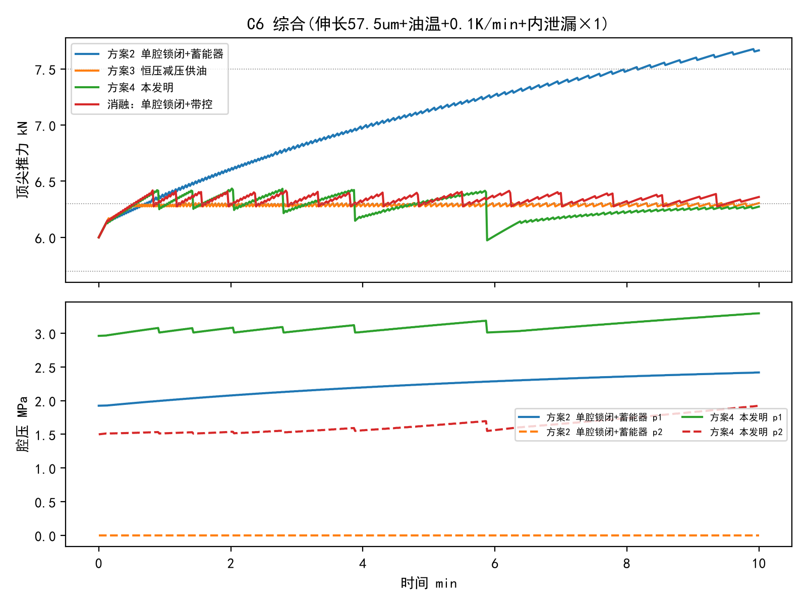

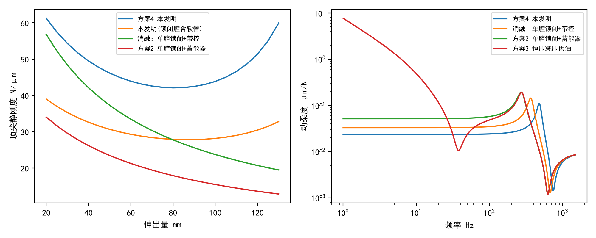

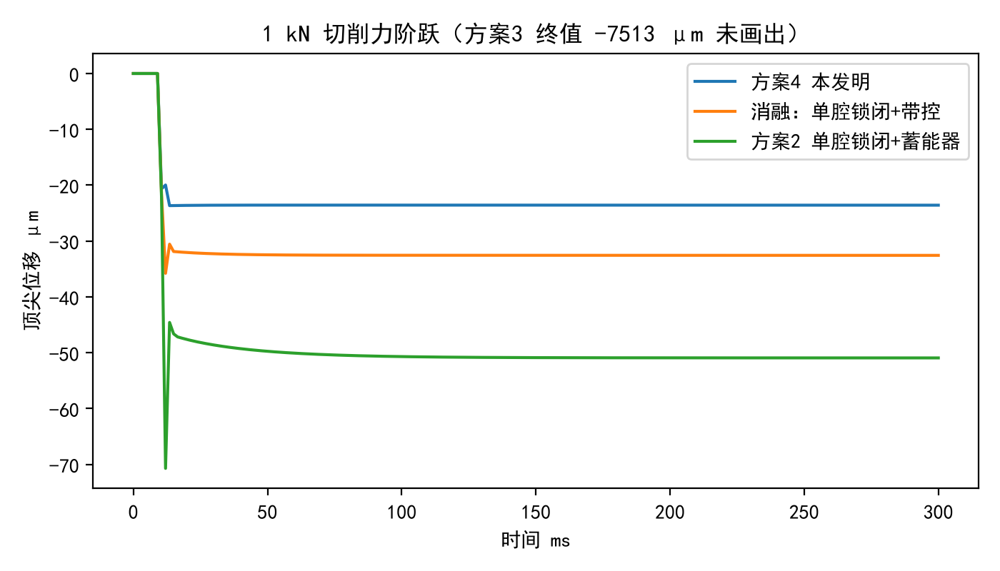

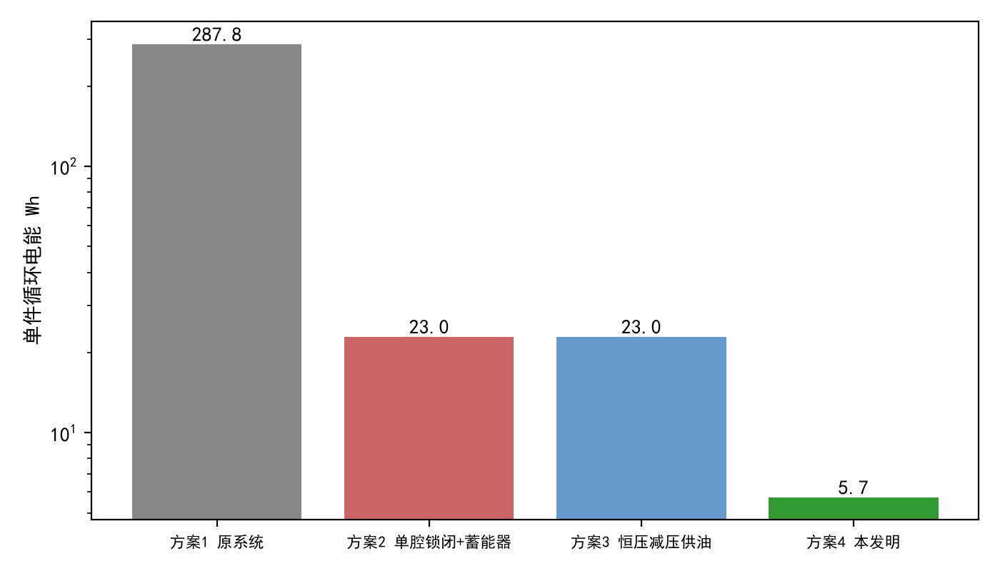

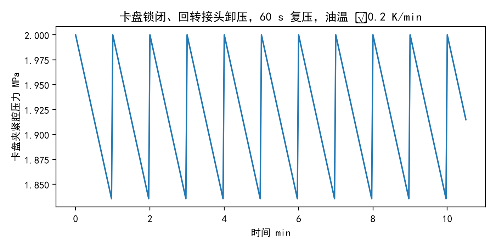

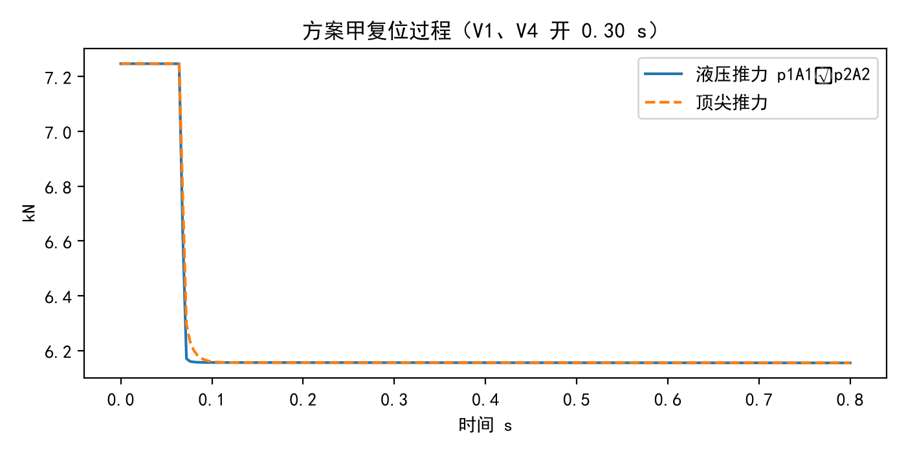

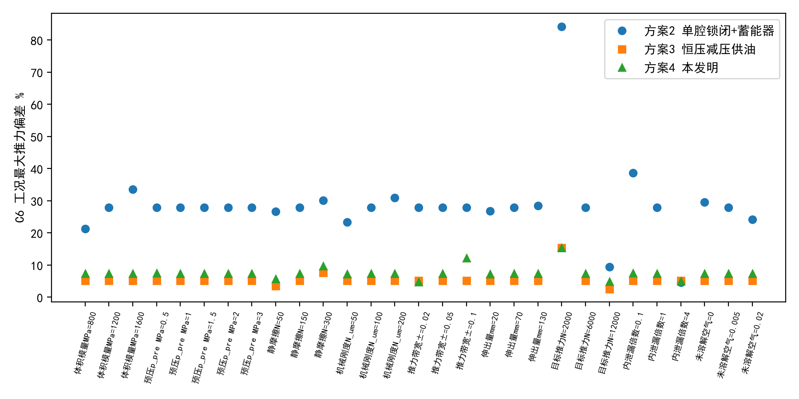

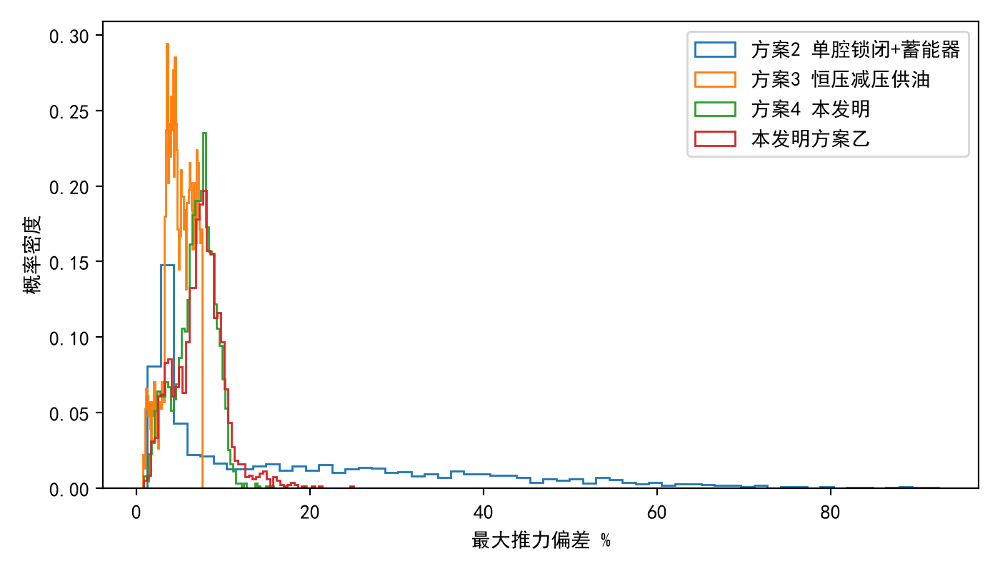

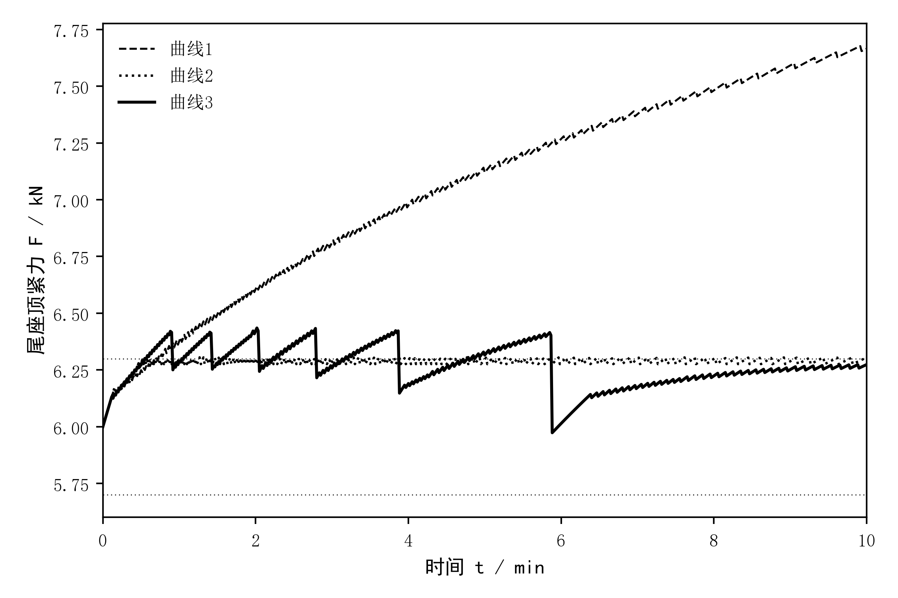

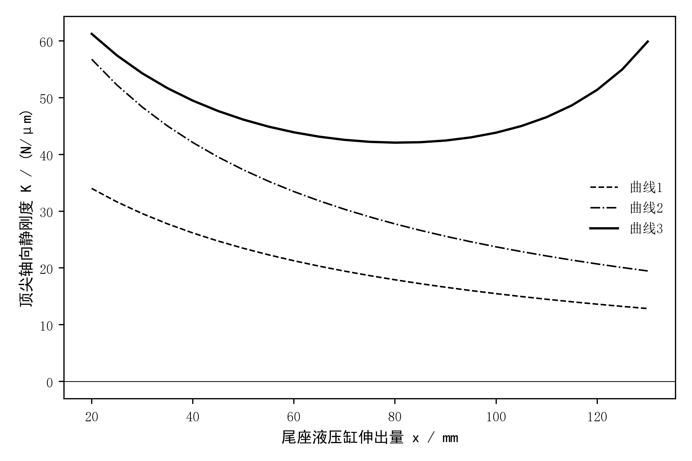

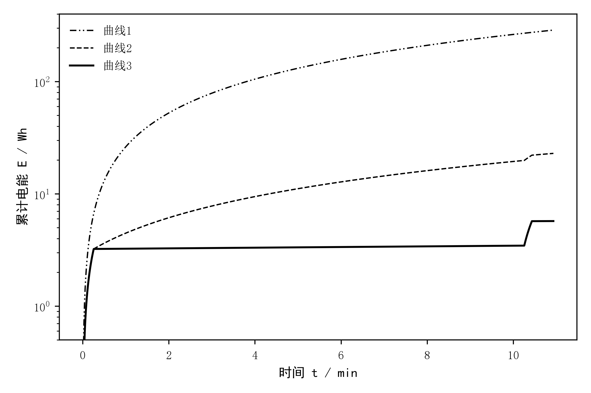
